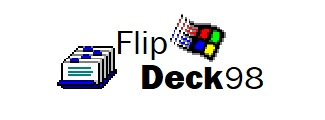

<p align="center">
  
</p>

# FlipDeck '98

FlipDeck '98 is a nostalgic study tool that helps you create and review flashcards for effective learning. The application was developed using modern web technologies, including Node.js, Express, PostgreSQL, and EJS for server-side rendering as part of a semester project. You can view a presentation of the project [here](https://docs.google.com/presentation/d/1gWt_f4M2_RhS5lTGhnSGvObCFeCTu7fZcndTqeq81C8/edit?usp=sharing).

## Table of Contents

- [Features](#features)
- [Prerequisites](#prerequisites)
- [Installation](#installation)
- [Usage](#usage)
  - [Creating Flashcards](#creating-flashcards)
  - [Studying Flashcards](#studying-flashcards)
  - [Managing Your Deck](#managing-your-deck)
- [License](#license)
- [Acknowledgments](#acknowledgments)

## Features

- **Create and manage flashcards** with customizable prompts and answers
- **Study mode** with flip card animation for effective memorization
- **Shuffle cards** to randomize your study session
- **Built-in study timer** to track your learning sessions
- **Search functionality** to quickly find specific cards
- **Sort options** to organize cards by creation date
- **Responsive design** works on desktop and mobile devices
- **Pagination** for easier navigation through large decks

## Prerequisites

Before you begin, ensure you have the following installed on your system:

- [Node.js](https://nodejs.org/) (v16 or later)
- [npm](https://www.npmjs.com/) (comes with Node.js)
- [PostgreSQL](https://www.postgresql.org/) (v12 or later)

## Installation

Follow these steps to get FlipDeck '98 running locally:

1. **Clone the repository**

    ```bash
    git clone https://github.com/jennxsierra/flipdeck-98.git
    cd flipdeck-98
    ```

2. **Install dependencies**

    ```bash
    npm install
    ```

    This will install all the required packages listed in `package.json`.

  > [!NOTE]
  >
  > If you encounter any issues with the installation, ensure that you have the correct version of Node.js and npm installed.

3. **Set up environment variables**

    ```bash
    cp .env.example .env
    ```

    Edit the `.env` file and update the values as needed, particularly the database credentials.

  > [!WARNING]
  >
  > Ensure that any changes to the `.env` file are made before running the setup script.

3. **Run the setup script**

    ```bash
    npm run setup
    ```

    This script will:

    - Create the database and database user
    - Set up the database schema and seed initial data
    - Install dependencies
    - Build the project

  > [!WARNING]
  >
  > The setup script is made with the assumption that you are using a Linux-based system.
  > It also assumes the existence of a PostgreSQL user with superuser privileges and an accompanying PostgreSQL database.
  > If you encounter any issues, please check the script for any hardcoded paths or commands that may not work on your system.

4. **Start the application**

    ```bash
    npm start
    ```

    The application should now be running at [http://localhost:3000](http://localhost:3000).

> [!TIP]
>
> For development with hot reloading:
>
> ```bash
> npm run dev
> ```

### Project Structure

```markdown
flipdeck-98/
├── public/               # Static assets
│   ├── assets/           # Images and other assets
│   ├── css/              # Stylesheets
│   └── scripts/          # Client-side JavaScript
├── src/                  # Server-side source code
│   ├── app.ts            # Main application file
│   ├── config/           # Configuration files
│   ├── controllers/      # Route controllers
│   ├── middleware/       # Express middleware
│   ├── models/           # Data models
│   ├── routes/           # Route definitions
│   ├── utils/            # Utility functions
│   └── views/            # EJS templates
├── .env.example          # Environment variables template
├── package.json          # Project metadata and dependencies
├── README.md             # Project documentation
├── setup.js              # Setup script
└── tsconfig.json         # TypeScript configuration
```

## Usage

### Creating Flashcards

1. Click the `Add Flashcard` button in the sidebar
2. Enter your prompt (question) and answer
3. Click `Add` to save the flashcard

### Studying Flashcards

1. Click the `Study Deck` button
2. Click on the card to flip between prompt and answer
3. Use the navigation buttons or arrow keys to move between cards
4. Use the shuffle button to randomize the order of cards
5. Use the timer controls to track your study session

### Managing Your Deck

- **Search**: Use the search box to find specific cards
- **Sort**: Change the sort order using the dropdown menu
- **Edit**: Click the edit icon on a card to modify it
- **Delete**: Click the delete icon to remove a card

## License

This project is licensed under the MIT License - see the [LICENSE](LICENSE) file for details.

## Acknowledgments

- This project was developed as part of an assignment for the **[CMPS2212] GUI Programming** course under the Associate of Information Technology program at the [University of Belize](https://www.ub.edu.bz/).
- Shout out to [Windows 98 Icon Viewer](https://win98icons.alexmeub.com/) for the icons used in the logo as well as the favicon.
- [Font Awesome](https://fontawesome.com/) for the icons used in the application.
- Special thanks to Mr. Dalwin Lewis for his guidance and support.
